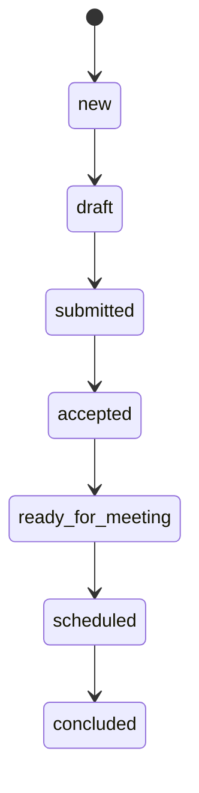

# Revu assessment workflow

This document explains the end-to-end assessment and review lifecycle in Revu.

## End-to-end view

```mermaid
flowchart LR
  A[Admin creates active review period] --> B[Admin creates self and peer question sets]
  B --> C[Manager or admin configures assignments and reviewers]
  C --> D[Employee or peer opens assigned assessment]
  D --> E[draft]
  E --> F[submitted]
  F --> G[Manager or admin accepts]
  G --> H[ready_for_meeting]
  H --> I[scheduled]
  I --> J[Reviewer 1 concludes]
  I --> K[Reviewer 2 concludes]
  J --> L[concluded when required reviewer conclusions are complete]
  K --> L
  L --> M[Admin archives the review period when the cycle is complete]
```

## Lifecycle states

| State | Meaning | Typical actor |
| --- | --- | --- |
| `new` | The assessment exists but no real work has been saved yet. | Employee or peer assessor |
| `draft` | Work has started but has not been submitted. | Employee or peer assessor |
| `submitted` | The author finished the assessment and handed it off. | Employee or peer assessor |
| `accepted` | A manager or admin accepted the submission for the next phase. | Manager or admin |
| `ready_for_meeting` | The set is prepared for the meeting/review step. | Manager or admin |
| `scheduled` | The review meeting or review activity has been scheduled. | Manager or admin |
| `concluded` | Required reviewer conclusions are complete. | Reviewer 1 / Reviewer 2 |

## Role responsibilities

## Employees and peer assessors

- complete self or peer assessments
- save draft work
- submit finished assessments

## Managers

- oversee employee progress
- accept submitted work
- move work into meeting-ready and scheduled stages
- maintain reporting relationships and assignments where permitted

## Reviewers

- add reviewer conclusions after the scheduled stage
- complete the reviewer-specific follow-up work needed for conclusion

## Admins

- set up the cycle
- manage question sets, employees, assignments, and workflow content
- use Assessments for overrides and visibility
- archive the review period after the cycle is finished

## Workflow notes

- `Dashboard` is the shared day-to-day workflow surface.
- `Assessments` is the admin override and visibility surface for the active review period.
- A review period can be archived so it becomes historical and read-only.
- Reviewer completion can depend on one or two assigned reviewers, depending on employee configuration.

## Visual state sequence

